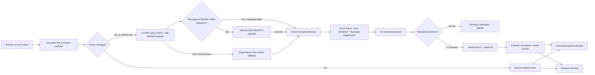

# Aether Vision RAG architecture

This document describes the implemented 2026 pipeline. It replaces the original single-frame YOLOS path, where every raw prediction could immediately become an overlay, inventory item, narrative statement, and memory entry.

## Design goals

1. Prefer a short verification delay over a confident false statement.
2. Keep uploaded video private in the hosted GitHub Pages demo.
3. Use dedicated NVIDIA/AMD hardware automatically, with a tested CPU fallback.
4. Separate fast visual detection from temporal truth and narrative generation.
5. Store scene events, not a stream of unverified per-frame guesses.

## End-to-end flow


## Why the original path failed

The previous hosted detector used a heavily quantized YOLOS-tiny model, accepted predictions at `0.25`, and treated each frame independently. On the supplied test clip it reported several phones and wine glasses around a seated person's face and chair. Those predictions were then repeated by the narrator as facts. The visible pipeline latency was roughly 527 ms, while the UI sampled only once every 1.8 seconds, producing about 1 result per second.

This was an architecture problem rather than a training problem that could be fixed with one threshold:

- no temporal evidence requirement;
- no persistent track identity;
- no event lifecycle;
- weak duplicate suppression;
- one score floor for visually different classes;
- aggressive 4-bit weights on the GPU path;
- narration coupled directly to raw boxes.

## Implemented hosted pipeline

### 1. Bounded acquisition

The browser samples at most one frame every 700 ms and never queues inference work. Frames are resized to a maximum edge of 640 px before entering a module worker.

### 2. Scene gate

A 16×16 luminance signature measures visual change. An unchanged scene reuses verified tracks, while a forced refresh occurs every 2.6 seconds. This reduces redundant detector work without letting a static scene become permanently stale.

### 3. Hardware and precision scheduler

The worker starts the int8 WASM detector first and reports it ready before attempting acceleration. It then requests a high-performance WebGPU adapter; recognized NVIDIA and AMD adapters receive a best-effort fp16 upgrade. The already-created CPU detector remains active if that upgrade fails. Only failure of the CPU model activates the dependency-free motion fallback.

### 4. Hardware-adaptive detectors

Both precision paths pin `onnx-community/dfine_n_coco-ONNX` at revision `380d2839c327efaf65dd0fe0c2c10ab7fadd5473` for 80 COCO categories. The int8 graph is the reliability baseline; the fp16 graph is attempted only as a progressive WebGPU enhancement. In installed-Chrome testing, CPU inference correctly identified people and the teddy bear in the supplied clip at roughly 0.3 seconds per analyzed frame. All runtime and model assets are served from the same origin; inference makes no model-host or CDN request.

### 5. Candidate quality filter

Before tracking, the worker:

- validates and clamps every box;
- rejects implausibly tiny or nearly full-frame boxes;
- applies a 0.48 default score floor;
- allows `person` at 0.42;
- requires 0.62 for commonly confused small classes such as phones, remotes, glasses, watches, and wine glasses;
- applies class-aware non-maximum suppression at 0.50 IoU;
- caps each analysis at 32 candidates.

### 6. Temporal verifier

Detections associate with existing same-class tracks at 0.28 IoU. Boxes and confidence use an exponential moving average. Normal classes require two consistent observations; ambiguous small classes require three. Tentative tracks are never exposed. Verified tracks tolerate two missed analyses before producing an `exited` event, which prevents flicker.

### 7. Grounded output contract

Only verified tracks can reach the overlay, object inventory, narrative, or memory. Narration reports counts, the most prominent object's coarse frame position, and newly confirmed changes. It does not infer activities, identities, intent, or relationships that were not measured.

## Self-hosted extension

The FastAPI mode remains the high-capability lane for YOLO-World, InsightFace, Qdrant, and optional Gemini synthesis. Its durable target contract is the same event model used in the browser:

```text
candidate detection -> verified track -> entered/persisted/exited event -> retrieval -> grounded synthesis
```

Generative narration must receive verified events and retrieved metadata, never unrestricted raw detector output. A larger vision-language captioner belongs in this lane or as an explicit, lazy-loaded browser option; it should run on scene-change keyframes rather than every video frame.

## Performance and quality budgets

| Measure | WebGPU upgrade target | CPU baseline target |
| --- | ---: | ---: |
| Frame sampler | 700 ms, no queue | 700 ms, no queue |
| Detector p95 | ≤ 600 ms | ≤ 1,500 ms |
| Stable object confirmation | 2 frames | 2 frames |
| Ambiguous object confirmation | 3 frames | 3 frames |
| Static-scene refresh | 2.6 s | 2.6 s |
| Raw false prediction entering memory | 0 after one frame | 0 after one frame |

These are acceptance budgets, not claims about every device. The UI reports the measured runtime and latest latency so regressions remain visible.

## Known boundaries

- D-FINE performs object detection, not action recognition or identity recognition; both browser precision paths share the 80-class COCO vocabulary.
- A browser-only static deployment cannot provide the same semantic detail as a large server-side vision-language model without a substantial first-load cost.
- Temporal verification removes transient hallucinations but cannot prove that a consistently wrong classifier label is correct; model evaluation on project-specific clips remains required.
- The fallback motion analyzer reports movement regions only and is intentionally not presented as semantic object recognition.
