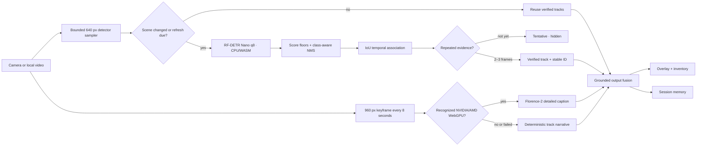

# Aether Vision RAG architecture

This document describes the implemented browser and self-hosted pipelines. The hosted path no longer treats single-frame detector output as truth and no longer depends on a weak detector to invent a scene narrative.

## Design goals

1. Prefer a short verification delay over a confident false statement.
2. Keep uploaded video frames inside the browser in hosted mode.
3. Use a dependable detector independently from the optional GPU narrator.
4. Detect NVIDIA/AMD acceleration automatically and retain a useful CPU path.
5. Store verified scene events and grounded keyframe descriptions, not raw guesses.

## Hosted end-to-end flow



The detector and captioner run in separate module workers. A caption failure, slow first download, or unsupported GPU cannot stop RF-DETR detection. Likewise, a fluent caption cannot make an unverified detector box appear in the overlay or inventory.

## Why the original path failed

The previous hosted detector used a heavily quantized, weak model, accepted low-confidence predictions, and narrated each frame independently. On the supplied clip it placed repeated phone and wine-glass labels around faces and furniture. Threshold tuning could not fix the missing architecture:

- no temporal evidence requirement;
- no persistent track identity or event lifecycle;
- insufficient duplicate suppression;
- narration coupled directly to raw boxes;
- one model responsible for both localization and scene meaning.

## Implemented hosted pipeline

### 1. Bounded acquisition and backpressure

Detector frames are resized to a maximum edge of 640 px. The UI requests a frame every 900 ms but never queues work while inference is busy. Florence receives a separate 960 px JPEG keyframe every eight seconds and also rejects overlapping work.

### 2. Scene gate

A 16×16 luminance signature measures visual change. An unchanged scene reuses verified tracks; a forced detector refresh occurs every 2.6 seconds.

### 3. Reliable object detector

The app bundles `onnx-community/rfdetr_nano-ONNX` at revision `eae21cee0687a91bcf9fa071605c48d7705d2d91`. Its q8 ONNX graph runs through WASM/CPU and covers the 80 COCO labels. The detector does not depend on WebGPU, so GPU graph compatibility cannot remove semantic object detection.

The dependency-free motion analyzer starts immediately while RF-DETR loads and remains the last-resort fallback if the bundled detector cannot initialize.

### 4. Candidate quality and temporal verification

Before tracking, the worker validates/clamps boxes, rejects implausible areas, uses a 0.48 default score floor, allows `person` at 0.42, and requires 0.62 for commonly confused small classes. It applies class-aware non-maximum suppression at 0.50 IoU and caps an analysis at 32 candidates.

Same-class tracks associate at 0.28 IoU. Normal classes require two consistent observations; ambiguous classes require three. Tentative tracks stay hidden. Verified tracks tolerate two missed analyses before emitting an `exited` event.

### 5. GPU keyframe narrator

A separate worker requests a high-performance WebGPU adapter and enables Florence only when the browser identifies a non-fallback NVIDIA or AMD adapter. It pins `onnx-community/Florence-2-base-ft` at revision `e88a44eaf3791a35eae0c5a47b3dbcd36e67eb6f` and uses the upstream mixed-precision configuration: fp16 vision/token embeddings when supported plus q4 encoder/decoder graphs.

Florence uses `<MORE_DETAILED_CAPTION>` on scene keyframes. Its model files are downloaded from Hugging Face on first use and stored in the browser cache; the video frame is processed locally and is never uploaded to Hugging Face or the repository owner. Without supported WebGPU, the verified object narrator remains active.

### 6. Grounded output contract

Only verified tracks can reach overlays and inventory. A recent Florence caption supplies scene-level meaning; otherwise the deterministic narrator reports verified counts, position, and entered/exited events. Session memory stores these stable observations instead of raw per-frame predictions.

## Measured acceptance result

Installed Chrome was tested with `ted's_class_insult.mp4` from the supplied Captures folder. The acceptance run required both detector and caption evidence and produced:

- verified `teddy bear` confidence around 0.98;
- multiple verified people around 0.98, plus chairs, tables, and books;
- 11 verified tracks in the inspected frame;
- the caption: “A brown teddy bear is sitting in a classroom. There are several people sitting at desks. There is a stack of paper on top of the desk.”;
- no stage error, failed request, or non-200 model/runtime asset response.

Cold Florence initialization took about two minutes on the tested machine; cached caption inference took roughly two to five seconds. RF-DETR usually completed a 640 px analyzed frame in roughly 0.6–1.5 seconds during the combined run. These are measured results, not guarantees for every device.

## Self-hosted extension

FastAPI remains the server lane for YOLO-World, InsightFace, Qdrant, and optional Gemini synthesis:

```text
candidate detection -> verified track -> entered/persisted/exited event -> retrieval -> grounded synthesis
```

Generative narration should consume verified events and retrieved metadata, never unrestricted raw detector output.

## Quality budgets

| Measure | Target |
| --- | ---: |
| Detector sampler | 900 ms, no queue |
| RF-DETR analyzed-frame p95 | ≤ 1,500 ms on the tested CPU |
| Stable object confirmation | 2 frames |
| Ambiguous object confirmation | 3 frames |
| Static-scene refresh | 2.6 s |
| Florence keyframe interval | 8 s, no queue |
| Single-frame raw prediction entering memory | 0 |

## Known boundaries

- RF-DETR uses the 80-class COCO vocabulary; it is not open-vocabulary action, identity, emotion, or relationship recognition.
- Florence captions are descriptive model output and can still be wrong. They add scene context but do not override verified detector boxes.
- The first Florence use is a substantial model download; progress is shown and assets are browser-cached.
- WebGPU adapter details are privacy-limited. Unknown vendors and software adapters use the CPU detector narrative.
- The motion fallback reports movement regions only and is intentionally not presented as semantic recognition.