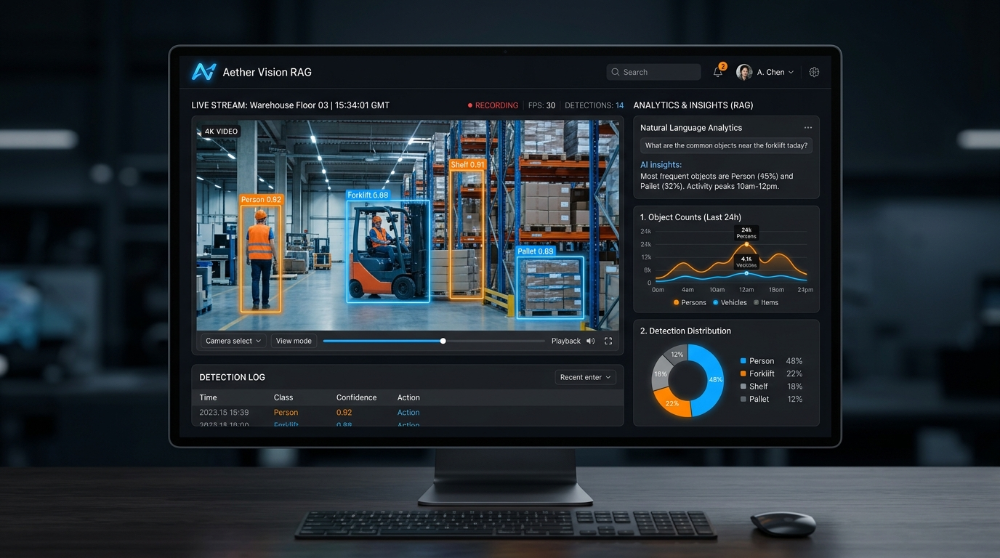

# 🌌 Aether Vision RAG

[](https://github.com/muhammadmahadazher/sota-vision-rag-pipeline)
[](https://github.com/muhammadmahadazher/sota-vision-rag-pipeline)
[](https://github.com/muhammadmahadazher/sota-vision-rag-pipeline)

A state-of-the-art, ultra-low-latency Multimodal Vision Retrieval-Augmented Generation (RAG) platform. **Aether Vision RAG** fuses advanced real-time computer vision transformations with state-of-the-art Generative AI to continuously track, index, and synthesize complex contextual narratives from any video stream or native webcam feed.

---

## 🎨 System Interface Mockup

Below is a preview design of Aether Vision RAG's space-black, high-contrast analytics dashboard:



---

## 🏗️ System Architecture

```
                                    +------------------------------+
                                    |      Webcam / MP4 Stream     |
                                    +------------------------------+
                                                   |
                                                   | (5 FPS Binary Frames)
                                                   v
                                    +------------------------------+
                                    |    Massive Vocabulary        |
                                    |    Detector (Objects365)     |
                                    +------------------------------+
                                                   |
                                                   | (Objects & Faces JSON)
                                                   v
                                    +------------------------------+
                                    |    Multimodal GenAI          |
                                    |    (Gemini 2.5 Flash API)    |
                                    +------------------------------+
                                                   |
                                                   | (Context Narration)
                                                   v
                                    +------------------------------+
                                    |    Local Vector Index        |
                                    |    (Qdrant Port 6333)        |
                                    +------------------------------+
                                                   |
                                                   | (Narratives / Matches)
                                                   v
                                    +------------------------------+
                                    |    Luxury Dashboard          |
                                    |    (Apple x Google UI)       |
                                    +------------------------------+
```

---

## 💎 Core Capabilities & Design Philosophy

### ⚡ Objects365 Massive Vocabulary Engine
By moving beyond the standard 80-category COCO limitations, the processing pipeline integrates **YOLO-World v2** pre-trained on the expansive **Objects365** dataset. This extends tracking capabilities across 365+ dense class categories (including everyday apparel items, complex tools, specific electronics, and structural layouts) with native GPU hardware acceleration.

### 🔌 Asynchronous WebSockets Loop
Frames are captured client-side and streamed binary-encoded over an IPv4 loopback socket (`ws://127.0.0.1:8000/api/stream`) at **5 FPS**. Bounding box matrices and facial embeddings are drew on a high-speed canvas layer overlay with negligible browser latency.

### 🛡️ Resilient Fail-Safe Ingestion
Both frontend and backend are equipped with predictive try-catch blocks. If a webcam disconnects, a video stream interrupts, or frames corrupt, the ASGI engine broadcasts a `"status": "Stream Disconnected"` token. The dashboard idles cleanly and displays a premium red warning screen rather than crashing.

### 🍏 Google Spatial Layout × Apple Minimalist Canvas
The interface combines the structural spacing rules of **Design.Google** with the dark physical layering of **Apple.com**:
* **Space-Black Canvas:** Pure `#000000` base with `#1C1C1E` deep slate surfaces.
* **Refraction Overlays:** High-density frosted glass bento panels with `backdrop-blur-3xl` and fractional-opacity borders (`border-white/[0.04]`).
* **Organic Kinetics:** custom cubic-bezier transitions (`ease: [0.16, 1, 0.3, 1]`) powered by Framer Motion.

---

## ⚙️ Turnkey Quick Start (Local Distribution)

This project features isolated scripts for automatic provisioning and single-click concurrent startup.

### 1. System Setup
Verify host dependencies (Python 3.12+ and Node.js), create a virtual environment (`.venv`), install pip packages, download the native standalone Qdrant binary from GitHub, and install frontend npm modules:
```powershell
# Windows
.\setup.bat

# Unix / macOS / Linux
./setup.sh
```

### 2. Launch Stack Concurrently
Launches the local standalone Qdrant server, FastAPI backend, and Next.js development server. If missing, the wrapper will prompt you *only once* in the console to save your `GEMINI_API_KEY`:
```powershell
# Windows
.\run.bat

# Unix / macOS / Linux
./run.sh
```

* **Web UI Dashboard:** `http://127.0.0.1:3000`
* **ASGI Backend Service:** `http://127.0.0.1:8000`
* **Qdrant Vector Database:** `http://127.0.0.1:6333`

---

*Status: 🚧 Project in Active Development / Beta. Core pipelines are verified running locally on NVIDIA RTX hardware layouts.*